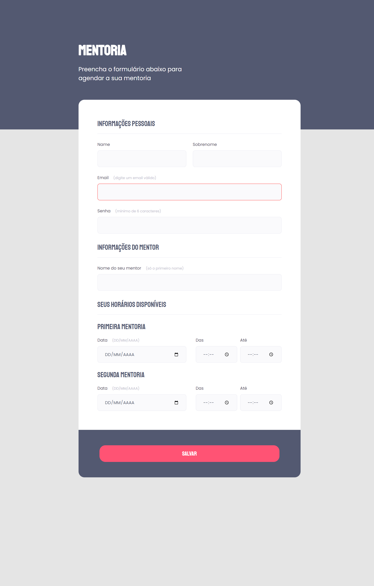
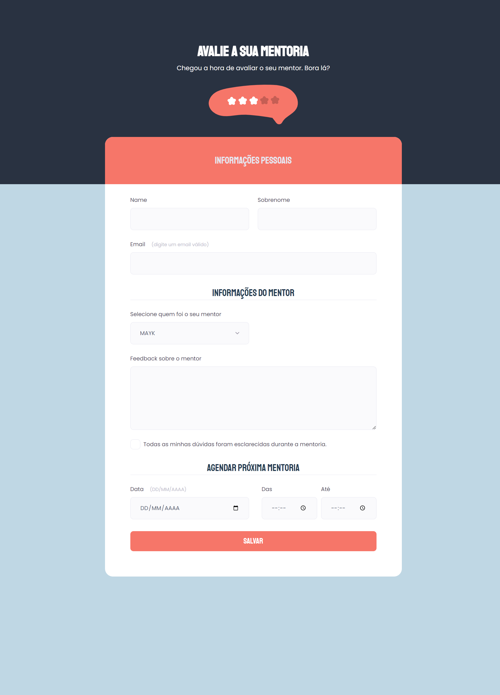

# Stage 3 desafio

- Building forms

### tools

[URL Encoder](https://yoksel.github.io/url-encoder/)

### Preview

Form 1

<div>
    
</div>

Form 2

<div>
    
</div>


### How to run locally

```
git clone git@github.com:vivianemartini/stage03-building-forms.git
cd stage03-building-forms
Run live server

```